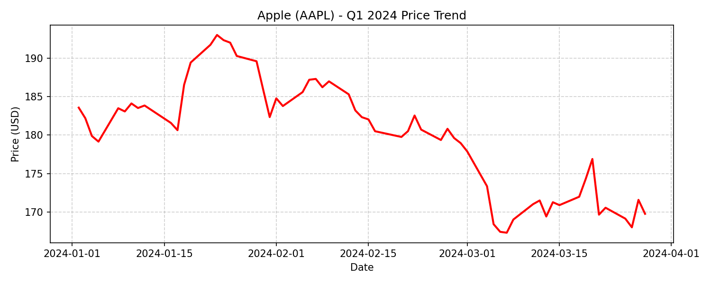
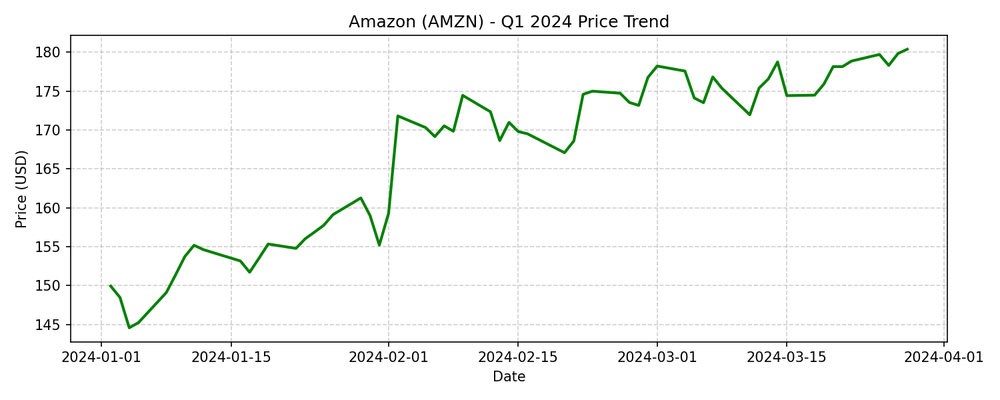

# Phân tích Hiệu suất Đầu tư (Q1 2024)

### 📊 Bảng Báo cáo Hiệu suất
<table style="text-align: center; width: 100%;">
  <thead>
    <tr>
      <th rowspan="2">Category</th>
      <th rowspan="2">Model</th>
      <th rowspan="2">Prompt</th>
      <th colspan="4">AAPL</th>
      <th colspan="4">GOOGL</th>
      <th colspan="4">AMZN</th>
    </tr>
    <tr>
      <th>CR% ↑</th><th>ARR% ↑</th><th>SR ↑</th><th>MDD% ↓</th>
      <th>CR% ↑</th><th>ARR% ↑</th><th>SR ↑</th><th>MDD% ↓</th>
      <th>CR% ↑</th><th>ARR% ↑</th><th>SR ↑</th><th>MDD% ↓</th>
    </tr>
  </thead>
  <tbody>
    <tr>
      <td rowspan="3">Ours w/o Memory</td>
      <td rowspan="3">Baseline</td>
      <td>ps_default_v1</td>
      <td>0.00</td><td>0.00</td><td>–</td><td>0.00</td>
      <td>-0.98</td><td>-3.80</td><td>-0.14</td><td>8.74</td>
      <td><b>20.00</b></td><td><b>105.01</b></td><td><b>3.00</b></td><td><b>4.22</b></td>
    </tr>
    <tr>
      <td>ps_macro_defensive_v1</td>
      <td>-9.74</td><td>-33.20</td><td>-2.39</td><td>11.65</td>
      <td>-2.19</td><td>-8.37</td><td>-0.65</td><td>6.09</td>
      <td>12.18</td><td>57.21</td><td>2.00</td><td>4.69</td>
    </tr>
    <tr>
      <td>ps_risk_aware_v1</td>
      <td>-3.76</td><td>-14.01</td><td>-2.57</td><td>4.86</td>
      <td>-2.19</td><td>-8.37</td><td>-0.65</td><td>6.09</td>
      <td>12.45</td><td>58.75</td><td>2.04</td><td><b>4.22</b></td>
    </tr>
    <tr>
      <td rowspan="3">Ours + Memory</td>
      <td rowspan="3">Weekly Learning</td>
      <td>ps_default_v1</td>
      <td>-13.04</td><td>-42.31</td><td>-3.07</td><td>13.60</td>
      <td>-3.81</td><td>-14.20</td><td>-0.82</td><td>8.74</td>
      <td>16.36</td><td>81.58</td><td>2.60</td><td><b>4.22</b></td>
    </tr>
    <tr>
      <td>ps_macro_defensive_v1</td>
      <td>-10.79</td><td>-36.22</td><td>-2.53</td><td>13.51</td>
      <td><b>2.35</b></td><td><b>9.56</b></td><td><b>1.51</b></td><td><b>1.10</b></td>
      <td>18.14</td><td>92.77</td><td>2.78</td><td><b>4.22</b></td>
    </tr>
    <tr>
      <td>ps_risk_aware_v1</td>
      <td><b>-1.82</b></td><td><b>-6.98</b></td><td><b>-1.25</b></td><td><b>3.06</b></td>
      <td>-2.19</td><td>-8.37</td><td>-0.65</td><td>6.09</td>
      <td>14.05</td><td>67.79</td><td>2.26</td><td><b>4.22</b></td>
    </tr>
  </tbody>
</table>

---

### 📉 Xu hướng Giá cổ phiếu (Q1 2024 Context)
Dưới đây là biểu đồ biến động giá của 3 mã cổ phiếu trong Quý 1/2024 để cung cấp góc nhìn trực quan về bối cảnh thị trường mà các mô hình đã giao dịch:

---

### 📈 Phân tích chi tiết (Analysis)

Dựa trên các số liệu gồm Lợi nhuận tích lũy (**CR%**), Lợi nhuận chuẩn hóa năm (**ARR%**), Tỷ lệ Sharpe (**SR**) và Mức sụt giảm tối đa (**MDD%**), dưới đây là phân tích hành vi của các mô hình:

#### 1. Hành vi trên từng loại tài sản (Các kịch bản thị trường)
- **AAPL (Thị trường giảm giá)**: Mã này đại diện cho xu hướng đi xuống của thị trường trong Q1 (Buy & Hold lỗ -7.91%).
  - Baseline `ps_default_v1` chọn giải pháp **tránh hoàn toàn rủi ro** (CR = 0, MDD = 0), tức là không giao dịch.
  - Tuy nhiên, sự vượt trội thể hiện rõ ở bản **có Memory kết hợp với prompt `ps_risk_aware_v1`**: chỉ chịu lỗ nhẹ **-1.82%** (so với -7.91% của thị trường) và ép MDD xuống chỉ còn **3.06%** (rất thấp so với 13.50% của thị trường).
- **GOOGL (Thị trường biến động/Tăng nhẹ)**: B&H đạt 12.87% nhưng đi kèm rủi ro MDD khá lớn (14.40%).
  - Đa số các Agent đều bị thua lỗ nhẹ hoặc không bắt kịp đà tăng. Tuy nhiên, điểm sáng cực lớn là cấu hình **Memory + `ps_macro_defensive_v1`**. Dù lợi nhuận chỉ ở mức 2.35%, hệ thống lại ghi nhận Mức sụt giảm cực đại (**MDD**) chỉ **1.10%** — mức phòng thủ xuất sắc trước những biến động giá của GOOGL.
- **AMZN (Thị trường tăng giá mạnh)**: Đại diện cho xu hướng uptrend mạnh (B&H đạt 22.26%).
  - Các Agent (cả có Memory và không) đều tận dụng rất tốt sóng tăng trưởng này, ghi nhận mức CR từ **12.18% đến 20.00%**. MDD của hệ thống cũng tương đương hoặc thấp hơn không đáng kể so với B&H (xung quanh 4.22%).
  - Baseline `ps_default_v1` đạt CR lớn nhất (20.00%), bám rất sát chiến lược Buy & Hold.

#### 2. Tác động của Khối bộ nhớ (Memory - Weekly Learning)
- **Đánh đổi Lợi nhuận để Lấy Sự An Toàn (Risk vs. Reward Trade-off)**: Khi nhìn vào AMZN, việc bật Memory dường như làm Agent trở nên "thận trọng" hơn. Cùng với `ps_default_v1`, bản Baseline chốt được 20.00% CR, nhưng bản có Memory chỉ đạt 16.36%.
- **Sức mạnh kết hợp đúng Prompt**: Memory phát huy tác dụng phòng thủ tối đa khi kết hợp với các prompt định hướng an toàn. Ví dụ: Memory + `ps_risk_aware_v1` trên AAPL đã giảm 3/4 rủi ro sụt giảm (MDD 3.06% so với 13.50% market). Tương tự Memory + `ps_macro_defensive_v1` trên GOOGL khiến đường cong vốn phẳng lỳ trước các rủi ro giảm sâu (MDD 1.10%).

#### 3. Vai trò của các Hệ Prompt (Prompt Set)
- **`ps_default_v1`**: Thiên về giao dịch thuận xu hướng (Trend-following). Bắt trọn sóng của AMZN xuất sắc nhất, nhưng lại rất mong manh khi cổ phiếu rớt giá (Lỗ -13.04% đối với AAPL ở bản có Memory).
- **`ps_macro_defensive_v1`**: Chuyên gia bình ổn định mức rủi ro trong môi trường biến động không rõ ràng (sideway/nhiễu) như GOOGL.
- **`ps_risk_aware_v1`**: Công cụ cắt lỗ và tối thiểu hóa rủi ro tốt nhất. Gần như cứu toàn bộ danh mục trên mã AAPL đang lao dốc bằng cách quản trị drawdown chặt chẽ.

### 🎯 Kết luận
Cơ chế **Weekly Learning (Memory)** dường như không sinh ra để "Tối đa hóa siêu lợi nhuận" mà nó hoạt động giống như một **"Lớp khiên bảo vệ drawdown"**. Việc chọn đúng loại Prompt phù hợp với trạng thái thị trường có vẻ đóng vai trò quan trọng không kém để điều phối mức độ giao dịch của hệ thống.

---

### 📖 Giải thích các chỉ số (Metrics)
- **CR% (Cumulative Return)**: *Lợi nhuận tích lũy*. Đo lường tổng mức sinh lời (hoặc lỗ) của toàn bộ danh mục từ đầu đến cuối kỳ đánh giá. Giá trị càng cao càng tốt.
  - *Công thức*: `CR(%) = [(V_end - V_start) / V_start] * 100` (Trong đó `V_start`, `V_end` là giá trị danh mục ở đầu và cuối kỳ).
- **ARR% (Annualized Return)**: *Lợi nhuận chuẩn hóa theo năm*. Mức lợi nhuận CR% được ngoại suy thành tốc độ sinh lời cho một năm chuẩn. Giá trị càng cao càng tốt.
  - *Công thức*: `ARR(%) = [(1 + CR)^(252/N) - 1] * 100` (Trong đó `N` là số ngày giao dịch thực tế trong kỳ, quy chuẩn `252` ngày giao dịch/năm).
- **SR (Sharpe Ratio)**: *Tỷ lệ Sharpe (Lợi nhuận điều chỉnh theo rủi ro)*. Cho biết với mỗi một đơn vị rủi ro phải chịu, hệ thống tạo ra được bao nhiêu đơn vị lợi nhuận. Chỉ số càng cao chứng tỏ hệ thống quản trị rủi ro càng hiệu quả.
  - *Công thức*: `SR = (R_p - R_f) / σ_p` (Trong đó `R_p` là lợi nhuận kỳ vọng của danh mục, `R_f` là tỷ suất sinh lời phi rủi ro, `σ_p` là độ lệch chuẩn lợi nhuận).
- **MDD% (Maximum Drawdown)**: *Mức sụt giảm cực đại*. Đo lường tỷ lệ tổn thất lớn nhất từ đỉnh vốn xuống đáy vốn trong kỳ đánh giá. Đại diện cho "rủi ro cháy tài khoản". Mức MDD càng thấp (càng gần 0) càng tốt, chứng tỏ khả năng phòng vệ xuất sắc.
  - *Công thức*: `MDD(%) = [(Peak - Trough) / Peak] * 100` (Trong đó `Peak` là đỉnh vốn cao nhất từng đạt được, `Trough` là đáy vốn thấp nhất ngay sau đỉnh đó).

---

### 🔬 Thảo luận Chuyên sâu & Cải tiến (Discussion & Improvements)

Kết quả thử nghiệm cho thấy sự kết hợp giữa **Memory (Weekly Learning)** và **Prompt Strategy** mang lại những cải tiến mang tính đột phá về mặt quản trị rủi ro, dù có sự đánh đổi nhất định về lợi nhuận tuyệt đối:

1. **Giải quyết bài toán "Sinh tồn" (Survival First)**:
   Nguyên tắc hàng đầu trong tài chính định lượng là bảo toàn vốn. Trong khi mô hình Baseline (không có bộ nhớ) thường tối đa hóa lợi nhuận trong môi trường Uptrend (AMZN) nhưng lại dễ tổn thất nặng khi thị trường đi xuống (AAPL), mô hình có Memory đã thể hiện khả năng "phòng vệ chủ động". Cụ thể, việc chấp nhận hy sinh một phần nhỏ lợi nhuận trên AMZN được bù đắp bằng việc ép MDD trên AAPL từ 13.50% xuống chỉ còn 3.06%. Đây là một minh chứng rõ ràng cho khả nă### 🗂️ Toàn bộ Dữ liệu Bộ nhớ (Memory Bank)

Để minh bạch hóa quá trình ra quyết định của Agent ở Arm B, dưới đây là **toàn bộ 13 bài học** hiện có trong tệp `memo_memory_bank.jsonl`. Bộ nhớ được chia làm 2 phần: Bài học mồi từ 2022 và Bài học tích lũy hàng tuần trong Q1/2024.

#### A. Nhóm Bài học mồi từ chu kỳ 2022 (Seed Memories)
Các bài học này được nạp vào mô hình trước khi chạy Q1/2024, đúc kết từ môi trường Bear Market để dạy Agent cách phòng thủ:

**1. Bearish Trend Following Underweight (bearish_momentum)**
- **Nhận định (Summary)**: AMZN is in a bearish momentum state with price below both SMA50 and SMA200, MACD negative, and a 15-row return of -7.4%. RSI is neutral, so the stock is not yet deeply oversold; this is more of a trend-confirmation setup than a rebound setup.
- **Hành động (DO)**:
  - Underweight or stay defensive when price is below both SMA50 and SMA200.
  - Treat negative MACD plus a recent multi-day decline as trend confirmation, not a dip-buy signal.
  - Wait for price to reclaim at least SMA50 with improving momentum before adding risk.
  - Use elevated volume on a down session as confirmation of active selling pressure.
- **Cần tránh (AVOID)**:
  - Do not Buy solely because RSI is neutral or because the stock is below a prior support area.
  - Do not overweight positive broker commentary when price action and momentum are deteriorating.
  - Do not assume a one-day bounce indicates trend reversal after a multi-week decline.
  - Do not average down into a below-SMA50/below-SMA200, negative-MACD regime.

**2. Regime-Sensitive Hold Bias (bearish_momentum)**
- **Nhận định (Summary)**: AMZN is in a bearish momentum regime: price is below both SMA50 and SMA200, RSI is weak, MACD is negative, and recent returns are down. In this state, the default edge is to avoid new longs unless there is a clear reversal catalyst. The observed winner/loser split shows that prompt sets can diverge between Hold and Buy, but the buy attempt under this setup lost on the weighted 1d/5d/20d reward horizon.
- **Hành động (DO)**:
  - Default to Hold when price is below both SMA50 and SMA200 and MACD is negative.
  - Require a confirmed reversal before taking a long: reclaim SMA50, improving RSI, and MACD cross/inflection.
  - Use the 20d horizon as the primary filter; if longer-horizon trend remains negative, avoid contrarian buys.
- **Cần tránh (AVOID)**:
  - Do not Buy solely because the stock is oversold or because there are mixed/supportive headlines.
  - Do not interpret moderate volume as a bullish breakout by itself.
  - Do not average into weakness while the trend stack remains bearish.

**3. Risk Off Trend Following (bearish_momentum)**
- **Nhận định (Summary)**: AMZN was in a high-conviction bearish momentum state: price below both SMA50 and SMA200, RSI weak, MACD negative, and the recent return was sharply down with elevated volume. This is a regime where the path of least resistance is still lower, so the prior trend dominates mixed fundamentals or short-term bounces.
- **Hành động (DO)**:
  - Underweight the position when price is below SMA50 and SMA200 and MACD is negative.
  - Require trend-reversal confirmation before upgrading to Buy, such as reclaiming SMA50 plus improving momentum.
  - Use elevated volume as confirmation of active selling unless price also breaks above resistance.
- **Cần tránh (AVOID)**:
  - Do not Buy solely because of short-term bounce or mixed supportive news.
  - Do not treat a one-day rebound as a regime change when RSI is still weak and MACD remains negative.
  - Do not override the trend with optimism from isolated analyst or business updates.

**4. Trend Continuation Short Bias (bearish_momentum)**
- **Nhận định (Summary)**: AMZN is in a high-conviction bearish momentum state: price is below both SMA50 and SMA200, RSI is weak, MACD is negative, and the recent return is sharply down on elevated volume. This is a regime where downside continuation is more actionable than mean reversion.
- **Hành động (DO)**:
  - Prefer Sell or reduce exposure when price is below both SMA50 and SMA200 and MACD is negative.
  - Use elevated volume on down days as confirmation that the bearish move is being accepted by the market.
  - Bias toward continuation over mean reversion in this exact regime, especially when the 20d horizon dominates scoring.
- **Cần tránh (AVOID)**:
  - Avoid Hold when all trend and momentum signals are aligned bearish.
  - Avoid waiting for positive news to rescue the trade if price action keeps weakening.
  - Avoid treating a weak RSI alone as an oversold bounce setup when the larger trend is still down.

**5. State-Specific Trade-Off (bullish_momentum)**
- **Nhận định (Summary)**: AMZN is in a fragile bullish-momentum transition: price is above SMA50 but still below SMA200, RSI is neutral, MACD is barely positive, and the recent 15-row return is still negative. This is a decision point where the market is bouncing inside a larger downtrend, so the edge depends on whether the model prioritizes trend continuation risk or the immediate reversal setup.
- **Hành động (DO)**:
  - Sell or trim when price is reclaiming only the short SMA but remains below the long SMA after a sharp recent decline.
  - Prefer exit/short-risk reduction if MACD is positive but close to zero and RSI is neutral, because momentum is not confirmed.
  - Use the bounce to de-risk when the prior trend was down and the rebound is not backed by strong momentum expansion.
- **Cần tránh (AVOID)**:
  - Avoid Hold when the move is just a relief bounce inside a broader bearish structure.
  - Avoid assuming a positive MACD alone means trend repair.
  - Avoid waiting for SMA200 recovery as the only confirmation if the recent drawdown is still dominant.

**6. Event Risk Momentum Split (bullish_momentum)**
- **Nhận định (Summary)**: AMZN was in a constructive momentum regime (above SMA50, below SMA200, RSI strong, MACD positive, return up) with unusually high volume, but it was also immediately before earnings. This is a classic high-variance inflection point where the same bullish technical setup can justify either Buy or Hold depending on whether the prompt prioritizes momentum continuation or event-risk avoidance.
- **Hành động (DO)**:
  - Buy when price is above SMA50, RSI is strong, MACD is positive, and volume confirms the move.
  - Treat pre-earnings momentum as tradable when the technical setup is aligned and the move is already underway.
  - Prefer participation over caution when the weighted scorer rewards 5d/20d continuation and there is no sign of technical exhaustion.
- **Cần tránh (AVOID)**:
  - Avoid automatic Hold just because an earnings announcement is imminent.
  - Avoid letting macro-defensive logic suppress a clean momentum signal without additional evidence of reversal or breakdown.
  - Avoid using SMA200 proximity as a reason to wait if the short-term trend is already confirmed and the trade horizon includes post-event continuation.

**7. Trajectory Reflection (bearish_momentum)**
- **Nhận định (Summary)**: AMZN was in a clear bearish momentum regime: price below both SMA50 and SMA200, RSI weak, MACD negative, and 15-row return down. This is a decisive inflection state because the same inputs produced opposite actions, and the weighted 1d/5d/20d scorer rewarded the path that caught a short-horizon continuation into a much larger 20d rebound.
- **Hành động (DO)**:
  - Treat the setup as a possible contrarian reversal candidate, not just a bearish trend-following setup.
  - Use a small Buy or starter long when the tape is weak but stretched and you are optimizing for 5d/20d reward.
  - Expect possible negative 1d noise and judge the trade on multi-day follow-through.
- **Cần tránh (AVOID)**:
  - Avoid automatic Underweight/flat decisions purely because price is below both moving averages.
  - Avoid overreacting to the negative MACD/RSI by assuming downside must continue immediately.
  - Avoid using this lesson for short-horizon scalps where 1d outcome dominates.

**8. Trajectory Reflection (bearish_momentum)**
- **Nhận định (Summary)**: AMZN is in a high-conviction bearish momentum state: price is below both SMA50 and SMA200, RSI is weak, MACD is negative, and the 15-session return is sharply down with elevated volume. This is a regime where trend-following pressure dominates and signals can diverge on whether to fade the move or respect the tape.
- **Hành động (DO)**:
  - Treat a deep selloff below SMA50 and SMA200 as a decisive momentum-break state.
  - Consider a small tactical Buy only if oversold conditions and reversal evidence appear together.
  - Use tight sizing and explicit risk limits when fading an extended decline.
- **Cần tránh (AVOID)**:
  - Avoid defaulting to Underweight just because the stock has fallen sharply.
  - Avoid assuming bearish momentum always implies further downside on the next 1d/5d/20d horizons.
  - Avoid scaling aggressively into the trend without a reversal catalyst.

#### B. Nhóm Bài học tích lũy hàng tuần (Q1/2024 Weekly Learning)
Các bài học này được Agent tự động tạo ra vào cuối mỗi tuần giao dịch trong Q1/2024 (phản tư - Reflection) để tối ưu hóa quyết định cho tuần tiếp theo:

**1. Tuần giao dịch: 2024-01-02 đến 2024-01-05**
- **Nhật ký (Reflection)**: Weekly Reflection (2024-01-02 to 2024-01-05): | Actions taken: {'AAPL: Hold': 8, 'GOOGL: Buy': 6, 'GOOGL: Underweight': 6, 'AMZN: Buy': 5, 'AMZN: Underweight': 4, 'AMZN: Hold': 3, 'AAPL: Buy': 2, 'AAPL: Underweight': 2} | Situational lesson: For setups resembling the week 2024-01-02 to 2024-01-05, compare the current technical/news evidence against the recent decision ledger before changing exposure. Avoid treating momentum alone as sufficient; require support/resistance, risk, and macro/social confirmation before increasing or reducing a position.

**2. Tuần giao dịch: 2024-01-08 đến 2024-01-12**
- **Nhật ký (Reflection)**: Weekly Reflection (2024-01-08 to 2024-01-12): | Actions taken: {'GOOGL: Buy': 8, 'AMZN: Underweight': 7, 'AMZN: Buy': 7, 'AAPL: Buy': 6, 'AAPL: Hold': 5, 'GOOGL: Underweight': 5, 'AAPL: Underweight': 4, 'GOOGL: Hold': 2, 'AMZN: Hold': 1} | Situational lesson: For setups resembling the week 2024-01-08 to 2024-01-12, compare the current technical/news evidence against the recent decision ledger before changing exposure. Avoid treating momentum alone as sufficient; require support/resistance, risk, and macro/social confirmation before increasing or reducing a position.

**3. Tuần giao dịch: 2024-01-15 đến 2024-01-19**
- **Nhật ký (Reflection)**: Weekly Reflection (2024-01-15 to 2024-01-19): | Actions taken: {'GOOGL: Buy': 6, 'GOOGL: Underweight': 6, 'AAPL: Underweight': 5, 'AAPL: Buy': 5, 'AMZN: Hold': 4, 'AMZN: Buy': 4, 'AMZN: Underweight': 4, 'AAPL: Hold': 2} | Situational lesson: For setups resembling the week 2024-01-15 to 2024-01-19, compare the current technical/news evidence against the recent decision ledger before changing exposure. Avoid treating momentum alone as sufficient; require support/resistance, risk, and macro/social confirmation before increasing or reducing a position.

**4. Tuần giao dịch: 2024-01-22 đến 2024-01-26**
- **Nhật ký (Reflection)**: Weekly Reflection (2024-01-22 to 2024-01-26): | Actions taken: {'AMZN: Hold': 8, 'GOOGL: Hold': 7, 'AAPL: Hold': 5, 'AAPL: Buy': 5, 'GOOGL: Underweight': 5, 'AAPL: Underweight': 4, 'AMZN: Buy': 4, 'AMZN: Underweight': 3, 'GOOGL: Buy': 3, 'AAPL: ': 1} | Situational lesson: For setups resembling the week 2024-01-22 to 2024-01-26, compare the current technical/news evidence against the recent decision ledger before changing exposure. Avoid treating momentum alone as sufficient; require support/resistance, risk, and macro/social confirmation before increasing or reducing a position.

**5. Tuần giao dịch: 2024-01-29 đến 2024-01-31**
- **Nhật ký (Reflection)**: Weekly Reflection (2024-01-29 to 2024-01-31): | Actions taken: {'AAPL: Hold': 7, 'AMZN: Hold': 6, 'GOOGL: Hold': 6, 'AMZN: Buy': 2, 'GOOGL: Underweight': 2, 'GOOGL: Buy': 1, 'AAPL: Underweight': 1, 'AMZN: Underweight': 1, 'AAPL: ': 1} | Situational lesson: For setups resembling the week 2024-01-29 to 2024-01-31, compare the current technical/news evidence against the recent decision ledger before changing exposure. Avoid treating momentum alone as sufficient; require support/resistance, risk, and macro/social confirmation before increasing or reducing a position.��n lẫn chu kỳ Uptrend 2021 và Bear Market 2022) để Agent có một góc nhìn thị trường cân bằng hơn, từ đó tối ưu hóa đồng thời cả tỷ suất sinh lời lẫn năng lực phòng vệ rủi ro.

---

### 🗂️ Trích xuất Bộ nhớ (Seed Memory từ Bear Market 2022)

Để hiểu rõ tại sao Agent ở **Arm B (Ours + Memory)** lại có quyết định phòng thủ xuất sắc (đặc biệt là với AAPL), dưới đây là nguyên văn một số bài học (Lessons Learned) đã được nạp vào bộ nhớ của mô hình từ dữ liệu năm 2022:

**1. Bài học về Cạm bẫy "Cổ phiếu giá rẻ" (Bearish Trend-Confirmation)**
- **Tóm tắt (Summary)**: Khi giá nằm dưới cả SMA50 và SMA200, MACD âm, nhưng RSI ở mức trung bình (chưa quá bán). Đây là cạm bẫy kinh điển kiểu *"trông có vẻ rẻ nhưng xu hướng đã gãy"*. Hành động đúng là giảm tỷ trọng (Underweight) để phòng thủ, tuyệt đối không bắt đáy (Dip-buying).
- **Nguyên tắc hành động (DO)**:
  - Ưu tiên giảm tỷ trọng hoặc giữ thế phòng thủ.
  - Phải đợi giá vượt lên lại SMA50 kèm động lượng tốt thì mới được cân nhắc mua.
- **Điều cần tránh (AVOID)**:
  - Không mua chỉ vì cổ phiếu rơi xuống vùng hỗ trợ cũ.
  - Không nghe theo các tin tức tích cực từ truyền thông/Broker khi hành động giá đang xấu đi.

**2. Bài học về Nhịp hồi phục giả (Fragile Bullish Transition)**
- **Tóm tắt (Summary)**: Giá vượt SMA50 nhưng vẫn nằm dưới SMA200 sau một đợt sụt giảm mạnh. Đây thường là nhịp hồi kỹ thuật để bán (sell-into-bounce) chứ không phải là sự đảo chiều bền vững.
- **Nguyên tắc hành động (DO)**: Bán hoặc chốt lời ngắn hạn khi giá chỉ mới vượt được SMA ngắn hạn. Sử dụng nhịp hồi để hạ rủi ro (de-risk) danh mục.
- **Điều cần tránh (AVOID)**: Tránh việc tiếp tục giữ (Hold) hoặc mua thêm, không được nhầm lẫn một nhịp nảy lên (relief bounce) với sự phục hồi xu hướng thực sự.

*(Dữ liệu trích xuất trực tiếp từ file: `memo_memory_bank.jsonl` của hệ thống huấn luyện).*
