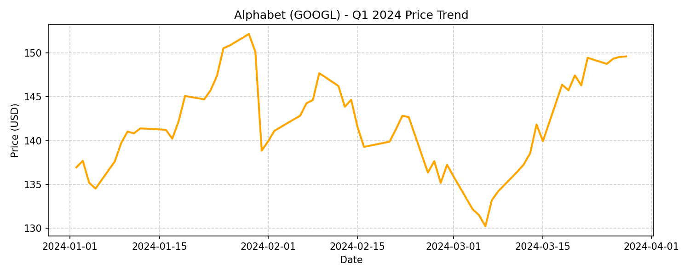

# Phân tích hiệu suất đầu tư Q1/2024

Tài liệu này tóm tắt benchmark Q1/2024 của `MemoAdapt` cho ba mã `AAPL`, `GOOGL` và `AMZN`. Mục tiêu là so sánh agent không dùng memory với agent dùng MeMo memory/weekly learning, trong cùng điều kiện offline point-in-time.

## 1. Bảng benchmark thị trường

| Symbol | CR% | ARR% | SR | MDD% |
|---|---:|---:|---:|---:|
| AAPL | -7.91 | -27.71 | -1.59 | 13.50 |
| GOOGL | 12.87 | 61.10 | 1.86 | 14.40 |
| AMZN | 22.26 | 120.63 | 3.22 | 4.22 |

## 2. Bảng benchmark agent

| Model | Prompt | AAPL CR% | AAPL ARR% | AAPL SR | AAPL MDD% | GOOGL CR% | GOOGL ARR% | GOOGL SR | GOOGL MDD% | AMZN CR% | AMZN ARR% | AMZN SR | AMZN MDD% |
|---|---|---:|---:|---:|---:|---:|---:|---:|---:|---:|---:|---:|---:|
| Ours w/o Memory | `ps_default_v1` | 0.00 | 0.00 | - | 0.00 | -0.98 | -3.80 | -0.14 | 8.74 | 20.00 | 105.01 | 3.00 | 4.22 |
| Ours w/o Memory | `ps_macro_defensive_v1` | -9.74 | -33.20 | -2.39 | 11.65 | -2.19 | -8.37 | -0.65 | 6.09 | 12.18 | 57.21 | 2.00 | 4.69 |
| Ours w/o Memory | `ps_risk_aware_v1` | -3.76 | -14.01 | -2.57 | 4.86 | -2.19 | -8.37 | -0.65 | 6.09 | 12.45 | 58.75 | 2.04 | 4.22 |
| Ours + Memory | `ps_default_v1` | -13.04 | -42.31 | -3.07 | 13.60 | -3.81 | -14.20 | -0.82 | 8.74 | 16.36 | 81.58 | 2.60 | 4.22 |
| Ours + Memory | `ps_macro_defensive_v1` | -10.79 | -36.22 | -2.53 | 13.51 | 2.35 | 9.56 | 1.51 | 1.10 | 18.14 | 92.77 | 2.78 | 4.22 |
| Ours + Memory | `ps_risk_aware_v1` | -1.82 | -6.98 | -1.25 | 3.06 | -2.19 | -8.37 | -0.65 | 6.09 | 14.05 | 67.79 | 2.26 | 4.22 |

## 3. Bối cảnh giá Q1/2024

Dưới đây là biểu đồ giá của ba mã trong Q1/2024. Các biểu đồ này giúp đặt kết quả agent vào bối cảnh thị trường thực tế.

## 4. Diễn giải theo từng mã

### AAPL: thị trường giảm

AAPL là tình huống kiểm tra khả năng phòng thủ. Buy & Hold lỗ `-7.91%` và chịu MDD `13.50%`.

Baseline `ps_default_v1` tránh toàn bộ rủi ro nên CR và MDD đều bằng `0.00`. Tuy nhiên, cấu hình đáng chú ý nhất là `Ours + Memory` với `ps_risk_aware_v1`: CR chỉ còn `-1.82%` và MDD giảm xuống `3.06%`. Đây là bằng chứng mạnh nhất cho tác dụng của memory trong việc giảm drawdown khi thị trường đi xuống.

### GOOGL: thị trường biến động, tăng nhẹ

GOOGL có Buy & Hold đạt `12.87%`, nhưng đi kèm MDD `14.40%`. Phần lớn agent không bắt trọn được upside. Điểm sáng nằm ở `Ours + Memory` với `ps_macro_defensive_v1`: CR dương `2.35%`, SR `1.51` và MDD chỉ `1.10%`.

Điều này cho thấy memory kết hợp với prompt phòng thủ vĩ mô có thể tạo đường vốn ổn định hơn, ngay cả khi hy sinh phần lớn upside của thị trường.

### AMZN: thị trường tăng mạnh

AMZN là tình huống uptrend rõ nhất. Buy & Hold đạt `22.26%`. Baseline `ps_default_v1` đạt `20.00%`, bám khá sát thị trường.

Khi bật memory, lợi nhuận của AMZN thấp hơn baseline tương ứng. Ví dụ `ps_default_v1` giảm từ `20.00%` xuống `16.36%`. Đây là trade-off dễ thấy: memory khiến agent thận trọng hơn, phù hợp với mục tiêu kiểm soát rủi ro nhưng không luôn tối ưu khi thị trường tăng mạnh và ít drawdown.

## 5. Tác động của memory

Memory không tạo lợi thế đồng đều trên mọi mã. Tác động chính là thay đổi hành vi rủi ro:

- Trên AAPL, memory giúp cấu hình risk-aware giảm lỗ và drawdown rõ rệt.
- Trên GOOGL, memory giúp cấu hình macro-defensive giữ MDD rất thấp.
- Trên AMZN, memory làm agent bớt aggressive, dẫn tới return thấp hơn baseline trong uptrend mạnh.

Vì vậy, MeMo Adapt nên được hiểu như một lớp điều tiết rủi ro hơn là cơ chế tối đa hóa lợi nhuận tuyệt đối.

## 6. Vai trò của prompt set

`ps_default_v1` thiên về bắt xu hướng. Prompt này hoạt động rất tốt trên AMZN, nhưng có thể yếu hơn khi thị trường giảm hoặc nhiễu.

`ps_macro_defensive_v1` phù hợp hơn với môi trường biến động không rõ xu hướng. Kết quả GOOGL cho thấy prompt này kết hợp với memory có thể giảm drawdown rất mạnh.

`ps_risk_aware_v1` là prompt kiểm soát rủi ro rõ nhất. Trên AAPL, cấu hình này kết hợp với memory tạo kết quả phòng thủ tốt nhất trong toàn bộ benchmark.

## 7. Giải thích chỉ số

- **CR% (Cumulative Return)**: lợi nhuận tích lũy của toàn kỳ đánh giá.
- **ARR% (Annualized Return)**: CR được quy đổi theo năm dựa trên số ngày giao dịch trong kỳ.
- **SR (Sharpe Ratio)**: lợi nhuận điều chỉnh theo rủi ro; càng cao càng tốt.
- **MDD% (Maximum Drawdown)**: mức sụt giảm lớn nhất từ đỉnh vốn xuống đáy vốn trong kỳ; càng thấp càng tốt.

## 8. Kết luận

Trong benchmark Q1/2024, MeMo Adapt thể hiện rõ nhất ở khả năng phòng thủ:

- Giảm drawdown tốt khi thị trường giảm hoặc nhiễu.
- Hỗ trợ prompt risk-aware và macro-defensive ra quyết định thận trọng hơn.
- Có thể đánh đổi một phần lợi nhuận trong thị trường uptrend mạnh.

Kết quả nên được đọc như bằng chứng về trade-off giữa return và risk control. Memory không thay thế dữ liệu hiện tại; nó bổ sung kinh nghiệm tình huống để portfolio manager cuối cùng cân nhắc trước khi ra quyết định.