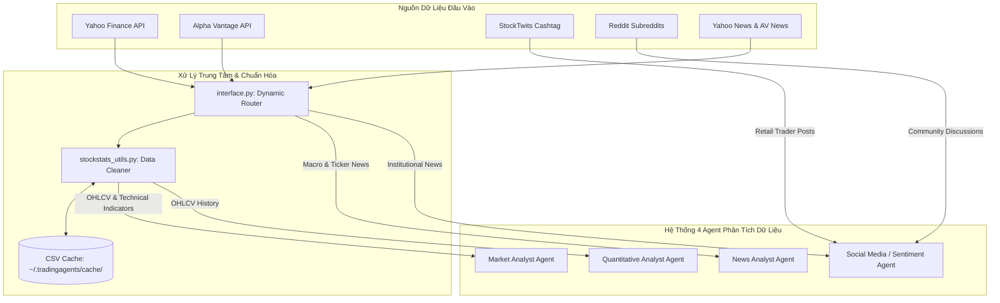

# 📊 CRYPTOAGENTS DATA LAYER: HƯỚNG DẪN THUYẾT TRÌNH TỐN GIẢN & CHUYÊN NGHIỆP
> **Hệ Thống Phân Tích Đầu Tư Đa Tác Nhân (Multi-Agent System) Dành Cho Thị Trường Tiền Mã Hóa 24/7**
>
> *Tài liệu được thiết kế tối giản, tập trung vào cấu trúc kỹ thuật đồng bộ, loại bỏ hoàn toàn các lời bình luận dài dòng. Mỗi Tác nhân Phân tích (Agent) được chia nhỏ thành các phần đặc tả kỹ thuật, cách thức truy cập/sử dụng nguồn dữ liệu, quy trình tiền xử lý chi tiết (mô tả + code thực tế) và mẫu dữ liệu đầu ra.*

---

## 📚 MỤC LỤC & KHUNG TIẾN TRÌNH LOGIC:
*   **PHẦN 1:** Cẩm nang bình dân (Hiểu rõ bản chất 4 loại dữ liệu đầu vào)   Nghĩa(Present) - Kiên(Slide)
*   **PHẦN 2:** Kiến trúc hệ thống & Dòng chảy dữ liệu trung tâm (3 Quy tắc vàng bảo toàn dữ liệu) Bích (present) - Việt (Slide)
*   **PHẦN 3:** Đặc tả kỹ thuật chi tiết của 4 Analyst Agents (Cơ chế truy cập, sử dụng & Code tiền xử lý ) Quyền(Present) - Khôi(Slide)

---

# 📚 PHẦN 1: CẨM NANG BÌNH DÂN (UNDERSTANDING THE DATA SOUL)

### 1.1. Dữ liệu Giá cả & Khối lượng (OHLCV)
*   **Open:** Giá giao dịch đầu tiên của ngày vào đúng **00:00:00 UTC**.
*   **High:** Mức giá cao nhất chạm tới trong ngày nhờ lực mua đẩy lên.
*   **Low:** Mức giá thấp nhất bị kéo tụt xuống do áp lực bán tháo.
*   **Close:** Giá khớp lệnh tại giây cuối cùng của ngày (**23:59:59 UTC**). Khi chạy ở thời gian thực (Real-time), Close tạm thời chính là **Giá khớp lệnh hiện tại** ngay lúc gọi API.
*   **Volume:** Tổng khối lượng giao dịch trong 24 giờ, dùng để nhận diện sự tham gia của cá mập.

### 1.2. Dữ liệu Cảm xúc Mạng xã hội (Sentiment)
*   **StockTwits:** Mạng xã hội chuyên bàn về trading coin. Đo lường tỷ lệ bài đăng mang nhãn **Bullish** (kỳ vọng tăng) và **Bearish** (kỳ vọng giảm).
*   **Reddit:** Diễn đàn thảo luận cộng đồng lớn. AI quét các subreddit tài chính, ưu tiên trích xuất các bài đăng có tương tác cao dựa trên lượng **Upvotes** (Thích) và **Comments** (Bình luận).

### 1.3. Dữ liệu Tin tức (News)
*   **Tin tức vi mô (Ticker News):** Sự kiện liên quan trực tiếp đến đồng coin cụ thể (Nâng cấp mạng lưới, thay đổi tokenomics).
*   **Tin tức vĩ mô (Macro News):** Sự kiện kinh tế toàn cầu (FED tăng giảm lãi suất, lạm phát Mỹ), ảnh hưởng tới dòng vốn chảy vào Crypto.

### 1.4. 4 Đặc trưng định lượng (Quantitative Features)
1.  **`log_ret` (Tỷ suất sinh lời Log):** $log\_ret_t = \ln(\text{Close}_t / \text{Close}_{t-1})$. Phản ánh thay đổi phần trăm giá một cách đối xứng toán học.
2.  **`hl_vol` (Biên độ giật giá):** $hl\_vol_t = (\text{High}_t - \text{Low}_t) / \text{Close}_t$. Đo lường độ biến động biến biên giá cực đại.
3.  **`vol_ratio` (Đột biến khối lượng):** $vol\_ratio_t = \text{Volume}_t / (\text{rolling\_mean}_{10}(\text{Volume}) + 1\times 10^{-8})$. Phát hiện dòng tiền đột biến gấp nhiều lần trung bình 10 ngày.
4.  **`ret_std` (Độ ổn định xu thế):** $ret\_std_t = \text{std}_{5}(\text{log\_ret})$. Đo độ bất ổn định xu hướng trong ngắn hạn.

---

# ⚙️ PHẦN 2: KIẾN TRÚC HỆ THỐNG & DÒNG CHẢY TRUNG TÂM

### 2.1. Sơ đồ dòng chảy dữ liệu tổng quan


### 2.2. Ba Quy tắc Vàng bảo toàn dữ liệu
1.  **Làm sạch dữ liệu (`_clean_dataframe`):** Áp dụng thuật toán **Forward-fill** (`df.ffill().bfill()`) điền các ô giá trị trống (`NaN`) bằng dữ liệu gần nhất, bảo vệ đồ thị chỉ báo không bị gãy.
2.  **Kháng thiên kiến nhìn trước tương lai (Look-ahead Bias):** Cắt bỏ cứng toàn bộ các dòng dữ liệu nằm ngoài thời gian backtest: `data = data[data["Date"] <= curr_date_str]`.
3.  **Dự phòng ngày liền trước (Preceding Day Fallback):** Nếu nến ngày hôm nay chưa hoàn thiện hoặc thiếu khối lượng do lệch múi giờ, hệ thống lùi lại lấy dữ liệu đóng nến ngày hôm qua (`curr_date - 1`).

---

# 🤖 PHẦN 3: ĐẶC TẢ KỸ THUẬT CHI TIẾT CỦA 4 ANALYST AGENTS

## 3.1. Market Analyst Agent: Phân Tích Chỉ Báo Kỹ Thuật
### 3.1.1. Nhiệm vụ cốt lõi
*   Theo dõi biến động thị trường qua mô hình đồ thị nến.
*   Xác định vùng quá mua/quá bán (RSI) và các điểm giao cắt xu hướng giá (MACD, Bollinger Bands).

### 3.1.2. Cách thức Truy cập & Sử dụng Nguồn dữ liệu
*   **Cách thức truy cập:**
    *   *Thư viện mạng:* Gọi hàm `yf.download(symbol, start, end)` để tải dữ liệu OHLCV lịch sử.
    *   *Địa chỉ lưu trữ Cache cục bộ:* Dữ liệu tải về được lưu tại `~/.tradingagents/cache/` dưới dạng file CSV đặt tên chuẩn hóa `{Symbol}-YFin-data-{Start}-{End}.csv`. Hệ thống luôn kiểm tra và đọc file cache cục bộ trước khi gửi yêu cầu mạng lên Yahoo.
    *   *Cơ chế định tuyến dự phòng (Vendor Fallback):* Module `interface.py` quản lý định tuyến. Nếu cuộc gọi yfinance bị rate-limit (HTTP 429) quá 3 lần liên tiếp, hệ thống tự động đổi vendor, gửi yêu cầu HTTP GET đến cổng Alpha Vantage API trực tuyến (`https://www.alphavantage.co/query`) kèm theo tham số `function=DIGITAL_CURRENCY_DAILY` và API Key lưu trong `config.py`.
*   **Cách thức sử dụng:**
    *   DataFrame chứa giá và khối lượng sau khi làm sạch được bọc vào wrapper của thư viện `stockstats`.
    *   Market Analyst Agent sử dụng kết quả tính toán của 12 chỉ báo kỹ thuật thô này làm tham chiếu. Nó so sánh các mốc giá trị (ví dụ: RSI cắt lên 30 hay cắt xuống 70) để kết luận trạng thái quá tải mua bán và cung cấp thông tin chiến lược cho Agent quản lý danh mục (Portfolio Manager).

### 3.1.3. Quy trình Tiền xử lý Dữ liệu
*   **Mô tả chi tiết các bước xử lý:**
    1.  *Làm sạch nến rỗng:* Tự động điền các ô giá trị rỗng hoặc ngày bị mất dữ liệu bằng thuật toán Forward-fill và Backward-fill (`df.ffill().bfill()`) để tránh làm đứt gãy chỉ báo kỹ thuật.
    2.  *Đồng bộ trường thời gian:* Định dạng lại cột ngày tháng `"Date"` của DataFrame sang chuẩn chuỗi thống nhất `%Y-%m-%d`.
    3.  *Date Pruning (Cắt tỉa Look-ahead):* Lọc bỏ hoàn toàn các hàng dữ liệu có ngày lớn hơn ngày chạy hiện tại (`curr_date`) của vòng lặp backtest.
    4.  *Tính toán chỉ báo kỹ thuật thô:* Kích hoạt dynamic getter của `stockstats` thông qua câu lệnh truy xuất cột `df[indicator]`, tự động tính toán các công thức toán học chỉ báo trên DataFrame lịch sử.
*   **Mã nguồn thực tế ([stockstats_utils.py#L136-L148](file:///e:/TradingAgents/tradingagents/dataflows/stockstats_utils.py#L136-L148)):**
    ```python
    # 1. Nạp dữ liệu thô và bọc vào class StockDataFrame
    data = load_ohlcv(symbol, curr_date)
    df = wrap(data)
    
    # 2. Định dạng ngày chuẩn hóa và thiết lập chronological filter
    df["Date"] = df["Date"].dt.strftime("%Y-%m-%d")
    curr_date_str = pd.to_datetime(curr_date).strftime("%Y-%m-%d")

    # 3. Dynamic getter kích hoạt stockstats tính toán tự động chỉ báo kỹ thuật thô
    df[indicator]  
    
    # 4. Trích xuất giá trị khớp chuẩn xác của ngày hiện tại đang chạy backtest
    matching_rows = df[df["Date"].str.startswith(curr_date_str)]
    if not matching_rows.empty:
        indicator_value = matching_rows[indicator].values[0]
    ```

### 3.1.4. Mẫu kết quả đầu ra gửi cho LLM
```
## rsi values from 2026-05-25 to 2026-05-31:
2026-05-31: 68.45 | 2026-05-30: 64.12 | 2026-05-29: 61.20 | 2026-05-28: 59.80
```

---

## 3.2. Sentiment Analyst Agent: Đánh Giá Cảm Xúc Mạng Xã Hội
### 3.2.1. Nhiệm vụ cốt lõi
*   Cào và phân tích cảm xúc đám đông nhỏ lẻ trên Reddit và StockTwits.
*   Tổng hợp thống lệ tỷ lệ bài Bullish/Bearish và các thảo luận nổi bật để đo độ hưng phấn thị trường.

### 3.2.2. Cách thức Truy cập & Sử dụng Nguồn dữ liệu
*   **Cách thức truy cập:**
    *   *Gọi API kết nối:* Hệ thống sử dụng thư viện mạng `urllib.request` để gửi yêu cầu mạng trực tiếp đến 2 cổng endpoint JSON:
        *   StockTwits Stream: `https://api.stocktwits.com/api/2/streams/symbol/{symbol}.json`.
        *   Reddit Search: `https://www.reddit.com/r/{sub}/search.json?q={symbol}&restrict_sr=on&sort=new&t=week`.
    *   *Header xác thực mạng:* Đối tượng `urllib.request.Request` được cấu hình đính kèm cặp key-value header: `{'User-Agent': 'tradingagents/0.2'}` để ngụy trang thành trình duyệt tùy chỉnh, tránh bị máy chủ của Reddit chặn HTTP 403. Không yêu cầu API Key đăng ký tốn phí.
*   **Cách thức sử dụng:**
    *   Các đoạn text sau khi cào về được bóc tách nhãn (đối với StockTwits) hoặc thống kê lượt thích/bình luận (Reddit).
    *   Tất cả bài viết được gộp chung và bao bọc trong các cặp thẻ XML phân vùng cụ thể inside system prompt. LLM sẽ đọc khối dữ liệu thô này để phân loại điểm số cảm xúc tổng quan của thị trường theo thang điểm từ 1 (Hoảng loạn cực độ) đến 5 (Fomo phấn khích tột độ).

### 3.2.3. Quy trình Tiền xử lý Dữ liệu
*   **Mô tả chi tiết các bước xử lý:**
    1.  *Phẳng hóa chuỗi (Text Flattening):* Loại bỏ hoàn toàn các ký tự xuống dòng `\n` và khoảng trống dư thừa trong bài viết, ép văn bản về một dòng duy nhất giúp LLM dễ đọc.
    2.  *Context-window Optimization (Cắt chuỗi tối ưu):* Cắt ngắn văn bản để bảo vệ dung lượng token của LLM: Reddit tối đa 240 ký tự, StockTwits tối đa 280 ký tự. Đuôi thừa bị cắt đi được thay thế bằng ký tự `…`.
    3.  *XML Fencing (Đóng khung ranh giới):* Bao bọc toàn bộ chuỗi văn bản cào được trong các cặp thẻ XML `<start_of_reddit>` và `<start_of_stocktwits>`. Cơ chế này ngăn chặn tuyệt đối các hành vi Prompt Injection từ văn bản rác ngoài mạng xã hội.
*   **Mã nguồn thực tế ([reddit.py#L85-L94](file:///e:/TradingAgents/tradingagents/dataflows/reddit.py#L85-L94) & [stocktwits.py#L59-L61](file:///e:/TradingAgents/tradingagents/dataflows/stocktwits.py#L59-L61)):**
    ```python
    # --- Tiền xử lý văn bản từ Reddit ---
    title = (p.get("title") or "").replace("\n", " ").strip()
    selftext = (p.get("selftext") or "").replace("\n", " ").strip()
    
    # Cắt ngắn chuỗi nếu vượt quá giới hạn token thiết lập cho Reddit
    if len(selftext) > 240:
        selftext = selftext[:240] + "…"

    # --- Tiền xử lý văn bản từ StockTwits ---
    body = (m.get("body") or "").replace("\n", " ").strip()
    if len(body) > 280:
        body = body[:280] + "…"
    ```

### 3.2.4. Mẫu kết quả đầu ra gửi cho LLM
```xml
<start_of_stocktwits>
Bullish: 18 (60%) · Bearish: 4 (13%) · Total: 30 messages
[2026-05-31T07:15:30Z · @whale_hunter · Bullish] Added more $BTC. Breakout is imminent.
[2026-05-31T07:12:45Z · @bear_trap · Bearish] $BTC double top on 4h. Dumping soon!
</start_of_stocktwits>
```

---

## 3.3. News Analyst Agent: Đọc Tin Tức Vi Mô & Vĩ Mô
### 3.3.1. Nhiệm vụ cốt lõi
*   Quét toàn diện các tin tức chính thống từ giới tài chính tổ chức.
*   Nhận diện các tin tức vĩ mô (FED, lạm phát) và vi mô (nâng cấp công nghệ coin) tác động đến xu hướng.

### 3.3.2. Cách thức Truy cập & Sử dụng Nguồn dữ liệu
*   **Cách thức truy cập:**
    *   *Truy vấn thư viện:* Gọi hàm `yf.Ticker(symbol).get_news()` để lấy luồng tin tức vi mô của coin; gọi đối tượng tìm kiếm toàn cầu `yf.Search(query).news` để tìm kiếm tin tức vĩ mô thông qua bộ từ khóa kinh tế vĩ mô có sẵn.
    *   *Truy cập REST API dự phòng:* Nếu Yahoo Finance quá tải, News Analyst tự động gọi GET Request lên cổng tin tức của Alpha Vantage: `https://www.alphavantage.co/query?function=NEWS_SENTIMENT&tickers={symbol}&apikey={KEY}` để tải gói tin tức định dạng JSON có tích kèm điểm số sentiment định lượng của Alpha Vantage.
*   **Cách thức sử dụng:**
    *   Các bản tin thô sau khi được chuẩn hóa múi giờ và lọc bỏ tin tương lai được tổng hợp thành danh sách tóm tắt (bao gồm: Tiêu đề, Tên nhà báo/Nhà xuất bản, Tóm tắt nội dung chính và Thời gian đăng).
    *   Dữ liệu được chuyển vào prompt của News Analyst Agent để LLM phân tích xem sự kiện này là một chất xúc tác tăng giá (Bullish Catalyst) hay tiêu cực (Bearish Catalyst), đóng vai trò thông tin đầu vào quan trọng cho các tác nhân giao dịch.

### 3.3.3. Quy trình Tiền xử lý Dữ liệu
*   **Mô tả chi tiết các bước xử lý:**
    1.  *Chuẩn hóa định dạng thời gian:* Thay thế ký tự múi giờ `"Z"` thành offset chuẩn `"+00:00"` trong chuỗi thời gian của Yahoo Finance để hàm `datetime.fromisoformat` phân tích cú pháp an toàn.
    2.  *Đưa về Naive Datetime:* Tước bỏ thông tin timezone (`replace(tzinfo=None)`) để chuyển đổi thành naive datetime, hỗ trợ so sánh logic an toàn.
    3.  *Chronological Firewall (Kháng Look-ahead):* Lọc loại bỏ toàn bộ các tin tức được đăng sau ngày chạy backtest hiện tại (`curr_date`), chống rò rỉ thông tin tương lai.
*   **Mã nguồn thực tế ([yfinance_news.py#L28-L92](file:///e:/TradingAgents/tradingagents/dataflows/yfinance_news.py#L28-L92)):**
    ```python
    # 1. Trích xuất thời gian và chuẩn hóa chuỗi múi giờ ISO
    pub_date_str = content.get("pubDate", "")
    if pub_date_str:
        try:
            pub_date = datetime.fromisoformat(pub_date_str.replace("Z", "+00:00"))
        except (ValueError, AttributeError):
            pass

    # 2. Tước bỏ timezone để so sánh đối chiếu thời gian
    if data["pub_date"]:
        pub_date_naive = data["pub_date"].replace(tzinfo=None)
        
        # 3. Lọc bỏ các bài viết nằm ở tương lai của timeline chạy backtest hiện tại
        if not (start_dt <= pub_date_naive <= end_dt + relativedelta(days=1)):
            continue 
    ```

### 3.3.4. Mẫu kết quả đầu ra gửi cho LLM
```
[News Catalysts for BTC-USD on 2026-05-31]
- Publisher: Bloomberg | Time: 2026-05-31 06:12:00
  Title: SEC Approves Spot Ethereum Options, Crypto Volume Surges Globally
  Summary: The SEC has officially approved trading options for spot crypto...
```

---

## 3.4. Quantitative Analyst Agent: Số Hóa Toán Học & Học Máy
### 3.4.1. Nhiệm vụ cốt lõi
*   Phát hiện các sự kiện biến động giá bất thường (Pump & Dump, Flash Crash) qua mô hình Autoencoder.
*   Phân loại xu hướng biến động giá của đồng coin trong 3 ngày tới qua mạng nơ-ron tuần tự LSTM.

### 3.4.2. Cách thức Truy cập & Sử dụng Nguồn dữ liệu
*   **Cách thức truy cập:**
    *   *Nguồn dữ liệu gốc:* Nhận dữ liệu OHLCV lịch sử 180 ngày trực tiếp từ cache cục bộ thông qua hàm `load_ohlcv` của `stockstats_utils.py`. Không gọi mạng trực tiếp trong luồng học máy để đảm bảo tốc độ tối đa.
*   **Cách thức sử dụng:**
    *   Các cột dữ liệu thô được biến đổi toán học phi tuyến thành 4 đặc trưng định lượng bằng Pandas/Numpy.
    *   Mảng 2D các đặc trưng được chuẩn hóa Min-Max về đoạn `[0, 1]`, sau đó băm nhỏ thành các cửa sổ cuốn chiếu sequence độ dài 10 ngày để tạo thành tensor 3D shape `(Samples, 10, 4)`.
    *   Tensor này được đưa thẳng vào mô hình TensorFlow:
        *   Mô hình **Autoencoder** thực hiện nén và giải nén sequence, tính sai số MSE tái lập để nhận diện điểm bất thường.
        *   Mô hình **LSTM** thực hiện dự báo xác suất 3 chiều cho xu hướng 3 ngày tới (UP/DOWN/HOLD).
    *   Kết quả phân tích định lượng (Anomaly flag, Trend Prediction class và độ tin cậy Confidence) được xuất ra dưới dạng báo cáo Markdown gửi cho Agent đầu não.

### 3.4.3. Quy trình Tiền xử lý & Bản chất Toán học của Dữ liệu
*   **Mô tả chi tiết 4 Đặc trưng định lượng biến đổi:**
    1.  **`log_ret` (Tỷ suất sinh lời Log):** 
        *   *Công thức:* $log\_ret_t = \ln(\text{Close}_t / \text{Close}_{t-1})$.
        *   *Bản chất vật lý của dữ liệu:* Phép tính logarithm tự nhiên giúp tỷ suất tăng (+50%) và giảm (-50%) đối xứng toán học hoàn hảo với nhau. Nó triệt tiêu hoàn toàn sự phi tuyến của thang giá thô, phản ánh trực tiếp động lực tăng trưởng thuần túy của đồng coin.
        *   *Phạm vi giá trị (sau chuẩn hóa Min-Max):* Thuộc khoảng $[0, 1]$. Giá trị tiệm cận $0.5$ đại diện cho ngày đi ngang (tỷ suất tiệm cận 0); giá trị tiệm cận $1.0$ là ngày bùng nổ giá tăng mạnh; giá trị tiệm cận $0.0$ đại diện cho ngày sụt giảm sâu.
    2.  **`hl_vol` (Biên độ giật giá / Relative Volatility):**
        *   *Công thức:* $hl\_vol_t = (\text{High}_t - \text{Low}_t) / \text{Close}_t$.
        *   *Bản chất vật lý của dữ liệu:* Tỷ lệ khoảng chênh lệch giữa giá cao nhất và thấp nhất trong ngày so với giá đóng cửa. Nó đo lường độ bất ổn định và tính thanh khoản đột ngột của cung cầu.
        *   *Ý nghĩa phân tích:* Biên độ giật càng lớn (hl_vol cao tiệm cận 1.0) báo hiệu các pha thanh lý đòn bẩy Long/Short quét hai đầu dữ dội, cảnh báo rủi ro biến động giật cục nguy hiểm.
    3.  **`vol_ratio` (Đột biến khối lượng / Volume Momentum):**
        *   *Công thức:* $vol\_ratio_t = \text{Volume}_t / (\text{rolling\_mean}_{10}(\text{Volume}) + 1\times 10^{-8})$.
        *   *Bản chất vật lý của dữ liệu:* Khối lượng giao dịch ngày hiện hành chia cho đường trung bình trượt 10 ngày gần nhất. Chỉ số này đo lường gia tốc của dòng tiền.
        *   *Ý nghĩa phân tích:* Giá trị vượt trội $> 1.0$ chứng tỏ khối lượng giao dịch hôm nay tăng vọt vượt trung bình (dấu chân của cá mập gom/xả hàng); giá trị $< 1.0$ báo hiệu sự cạn kiệt thanh khoản, thị trường đang đi ngang tích lũy.
    4.  **`ret_std` (Độ ổn định xu thế / Rolling Volatility of Returns):**
        *   *Công thức:* $ret\_std_t = \text{std}_{5}(\text{log\_ret})$.
        *   *Bản chất vật lý của dữ liệu:* Độ lệch chuẩn lăn trong cửa sổ 5 ngày của tỷ suất sinh lời log (`log_ret`). Chỉ số này đại diện cho độ rung lắc của xu hướng giá.
        *   *Ý nghĩa phân tích:* Giúp mô hình học sâu phân biệt rõ: xu thế hiện tại là một đợt sóng tăng/giảm mượt mà ổn định (ret_std thấp tiệm cận 0) hay là một pha co giật hỗn loạn, nhảy giá không ổn định (ret_std cao).
    5.  **Min-Max Scaling & Sequence Processing (Tensor 3D Formatting):**
        *   Loại bỏ nhiễu `NaN` bằng `.dropna()`.
        *   Sử dụng min-max scaling đưa toàn bộ đặc trưng về khoảng $[0, 1]$ để mô hình TensorFlow hội tụ nhanh hơn.
        *   Sử dụng cơ chế cửa sổ trượt (sliding window) kích thước 10 ngày để băm mảng đặc trưng 2D thành tensor 3D kích thước `(Samples, 10, 4)` đại diện cho chu kỳ 10 ngày liên tiếp, cung cấp trực tiếp vào lớp mạng nơ-ron Dense/LSTM.
*   **Mã nguồn thực tế ([quantitative_models.py#L12-L58](file:///e:/TradingAgents/tradingagents/dataflows/quantitative_models.py#L12-L58)):**
    ```python
    # 1. Tính toán 4 đặc trưng định lượng từ DataFrame thô
    df['log_ret'] = np.log(df['Close'] / df['Close'].shift(1))
    df['hl_vol'] = (df['High'] - df['Low']) / df['Close']
    vol_sma = df['Volume'].rolling(window=10).mean()
    df['vol_ratio'] = df['Volume'] / (vol_sma + 1e-8)
    df['ret_std'] = df['log_ret'].rolling(window=5).std()
    
    # Khử nhiễu NaNs sinh ra do dịch chuyển và tính rolling
    df = df.dropna().reset_index(drop=True)
    
    # 2. Chuẩn hóa Min-Max toàn bộ đặc trưng về khoảng [0, 1]
    cols = ['log_ret', 'hl_vol', 'vol_ratio', 'ret_std']
    data = df[cols].values
    min_vals = np.min(data, axis=0)
    max_vals = np.max(data, axis=0)
    range_vals = np.where(max_vals - min_vals == 0, 1e-8, max_vals - min_vals)
    scaled_data = (data - min_vals) / range_vals
    
    # 3. Tạo chuỗi sequence 3D tensor đầu vào shape (Samples, 10, 4)
    X = []
    for i in range(len(scaled_data) - 10 + 1):
        X.append(scaled_data[i:i + 10])
    X = np.array(X)
    ```

### 3.4.4. Mẫu kết quả báo cáo đầu ra gửi cho Agent đầu não
```markdown
### [TensorFlow Anomaly Detection Report for BTC-USD]
Analysis Date: 2026-05-31

| Metric | Value |
| --- | --- |
| **Market State** | NORMAL (Stable price action and volume) |
| **Reconstruction MSE** | 0.002481 |
| **Anomaly Threshold** | 0.015402 |
| **Total Historical Anomalies** | 4 occurrences |
| **Recent Anomaly Dates** | 2026-05-15, 2026-05-24 |
```