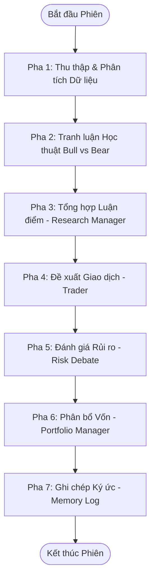

# PHẦN 1: TỔNG QUAN VÀ WORKFLOW HỆ THỐNG SOTA GỐC (TRADINGAGENTS)

## 1. Giới thiệu hệ thống TradingAgents (SOTA Gốc)
Hệ thống SOTA gốc (State-of-the-Art) mà chúng tôi chọn làm nền tảng đối chiếu là **TradingAgents**, một framework giao dịch đa tác tử (multi-agent) được xây dựng dựa trên LangGraph để mô phỏng quy trình phân tích và ra quyết định của một quỹ đầu tư chuyên nghiệp. Hệ thống này phân rã bài toán giao dịch tài sản (cổ phiếu) phức tạp thành các vai trò chuyên biệt, bao gồm:
*   **Analyst Layer (Tầng phân tích):** Gồm các nhà phân tích kỹ thuật (Market Analyst), phân tích tin tức (News Analyst), phân tích cơ bản (Fundamentals Analyst), và phân tích mạng xã hội (Sentiment/Social Media Analyst).
*   **Researcher Layer (Tầng nghiên cứu & phản biện):** Gồm hai tác tử đối lập là Bull Researcher (ủng hộ việc mua) và Bear Researcher (ủng hộ việc bán/đứng ngoài).
*   **Manager Layer (Tầng quản lý & ra quyết định):** Gồm Research Manager (tóm tắt luận điểm), Trader (đề xuất hành động cụ thể), và Portfolio Manager (phân bổ vốn rủi ro ròng).

---

## 2. Workflow chi tiết của hệ thống SOTA gốc từ đầu đến cuối
Quy trình hoạt động của hệ thống SOTA gốc diễn ra theo mô hình đồ thị có trạng thái tuần tự và lặp (StateGraph), được chia thành các pha cụ thể như sau:

### Bước 1: Khởi tạo và Tải dữ liệu Quá khứ (Pre-Pipeline & Memory Retrieval)
*   Khi có lệnh chạy từ người dùng với mã tài sản (`ticker`) và ngày giao dịch (`trade_date`), hệ thống khởi tạo `AgentState`.
*   Hệ thống đọc từ file nhật ký ghi chép quyết định cũ (`TradingMemoryLog`) dựa trên cơ chế **FIFO (First-In, First-Out)** để lấy tối đa 5 ký ức gần nhất của chính tài sản đó và 3 ký ức gần nhất của tài sản khác (cross-ticker). Luồng dữ liệu này được inject vào làm ngữ cảnh quá khứ (`past_context`).

### Bước 2: Tầng phân tích song song/tuần tự (Analyst Execution Plan)
Hệ thống gọi lần lượt các Analyst Node thông qua LangGraph. Mỗi Analyst sử dụng mô hình ngôn ngữ lớn (LLM) kết hợp gọi công cụ (Tool Calling):
1.  **Market Analyst:** Sử dụng công cụ `get_stock_data` và `get_indicators` để tính toán các chỉ báo kỹ thuật cơ bản (RSI, MACD, SMA, Bollinger Bands, ATR) từ dữ liệu lịch sử tải về qua Yahoo Finance.
2.  **Sentiment Analyst:** Sử dụng các công cụ cào tin tức hoặc mạng xã hội (Reddit, StockTwits) để phân tích hướng tâm lý của cộng đồng đầu tư.
3.  **News Analyst:** Gọi công cụ tin tức thế giới và tin tức doanh nghiệp để trích xuất các sự kiện trọng yếu và giao dịch nội bộ.
4.  **Fundamentals Analyst:** Truy xuất báo cáo tài chính (Bảng cân đối kế toán, Kết quả kinh doanh, Lưu chuyển tiền tệ) từ Yahoo Finance/Alpha Vantage để đánh giá sức khỏe tài chính doanh nghiệp.

### Bước 3: Tranh luận học thuật (Investment Debate)
*   Sau khi nhận đầy đủ báo cáo phân tích, hệ thống chuyển sang node **Bull Researcher** và **Bear Researcher**.
*   Hai tác tử này tiến hành tranh luận đối lập qua một số vòng cố định (thường là $K = 3$ vòng back-and-forth).
*   **Bull Researcher** tìm kiếm các điểm sáng, cơ hội tăng trưởng để bảo vệ luận điểm mua.
*   **Bear Researcher** chỉ ra các rủi ro vĩ mô, yếu tố kỹ thuật xấu và rủi ro báo cáo tài chính để bảo vệ luận điểm bán hoặc đứng ngoài.
*   Lịch sử tranh luận được lưu lại thành chuỗi hội thoại dài (`history`).

### Bước 4: Tổng hợp và Tạo đề xuất (Synthesis & Action)
*   **Research Manager** tiếp nhận toàn bộ lịch sử tranh luận từ tầng trước, tiến hành đánh giá tính logic của từng bên và viết ra một bản Kế hoạch Đầu tư (`investment_plan`) tổng hợp có cấu trúc khách quan.
*   Bản kế hoạch này chuyển sang tác tử **Trader**. Trader chịu trách nhiệm đưa ra khuyến nghị hành động cuối cùng dưới dạng tag rõ ràng: `FINAL TRANSACTION PROPOSAL: **BUY/HOLD/SELL**`.

### Bước 5: Đánh giá Rủi ro Đa góc nhìn (Risk Debate)
*   Trước khi ra quyết định phân bổ vốn, khuyến nghị của Trader được đưa qua một ban đánh giá rủi ro gồm 3 chuyên gia: **Aggressive Analyst**, **Conservative Analyst**, và **Neutral Analyst**.
*   Các tác tử này tranh luận luân phiên (cố định 3 vòng) về tỷ lệ phân bổ vốn an toàn cho lệnh, chỉ ra các kịch bản thị trường xấu nhất và mức độ chịu đựng drawdown.

### Bước 6: Phân bổ Vốn và Quyết định Cuối cùng (Portfolio Manager)
*   **Portfolio Manager** tiếp nhận toàn bộ báo cáo từ tầng rủi ro, kế hoạch của Research Manager và khuyến nghị của Trader để đưa ra quyết định cuối cùng.
*   Đầu ra của Portfolio Manager là một cấu trúc JSON nghiêm ngặt (`PortfolioDecision`) chứa:
    *   `rating`: BUY, HOLD, hoặc SELL.
    *   `target_weight`: Tỷ trọng phân bổ vốn đề xuất (từ 0.0 đến 1.0).
    *   `rationale`: Lý do chi tiết.
    *   `risk_management_notes`: Các chỉ dẫn phòng thủ.

### Bước 7: Lưu trữ Ký ức và Hoàn tất (Post-Pipeline Reflection)
*   Quyết định giao dịch được lưu vào file markdown nhật ký dưới trạng thái `pending` (chưa rõ kết quả lời lỗ thực tế).
*   Ở phiên giao dịch tiếp theo của chính tài sản đó, hệ thống sẽ thực hiện bước phản biện trì hoãn (deferred reflection): tính toán lợi nhuận thực tế sau một chu kỳ nắm giữ, gọi tác tử **Reflector** viết một đoạn tự kiểm điểm (reflection) dài 2-4 câu, cập nhật trạng thái từ `pending` sang `resolved` trong nhật ký để chuẩn bị cho các chu kỳ đọc tiếp theo.
