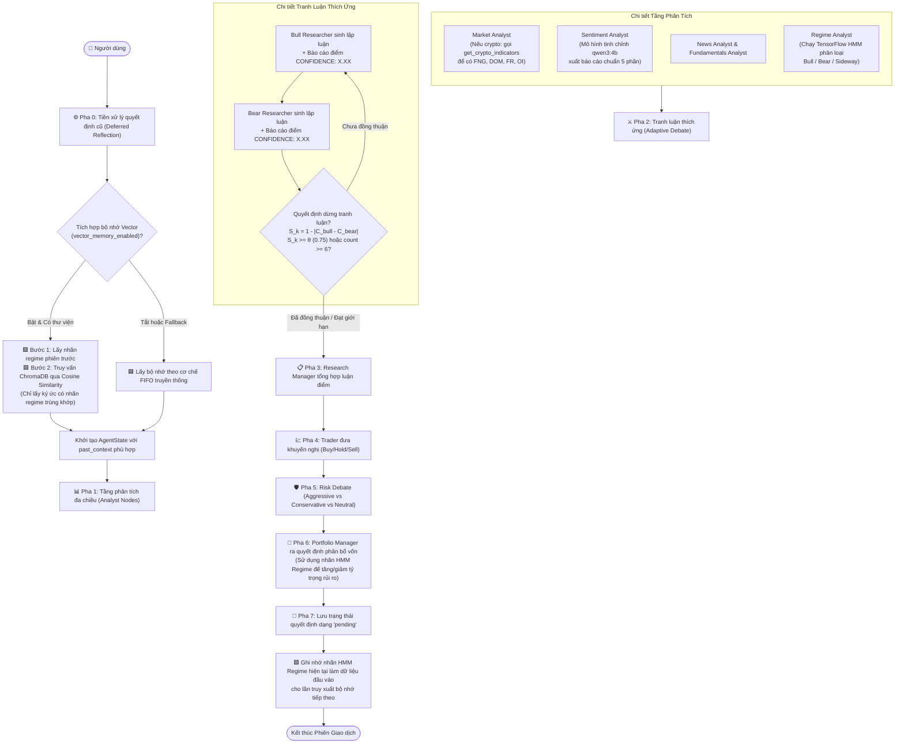

# PHẦN 4: WORKFLOW HỆ THỐNG SAU KHI CẢI TIẾN (IMPROVED WORKFLOW)

Hệ thống sau khi tích hợp toàn bộ 5 trụ cột cải tiến vẫn giữ cấu trúc StateGraph của LangGraph nhưng được bổ sung các dòng dữ liệu thông minh và các node ra quyết định động. Sơ đồ dưới đây mô tả chi tiết luồng xử lý toàn diện của hệ thống cải tiến.

---

## 1. Sơ đồ luồng hoạt động tổng thể (Improved System Workflow)

---

## 2. Chi tiết cơ chế tương tác giữa các thành phần mới

### A. Tương tác giữa HMM Regime (Trụ cột B) và Vector Memory (Trụ cột C2)
*   **Vòng lặp kín của pha thị trường:** Ở cuối phiên giao dịch trước, nhãn thị trường do tác tử HMM dự báo (ví dụ: `Bear`) được lưu tạm thời vào biến trạng thái chạy của đồ thị (`self._last_regime`).
*   **Truy xuất thông tin phù hợp:** Ở đầu phiên giao dịch tiếp theo, phương thức `get_past_context(regime=...)` nhận tham số `Bear` này. Tác tử `RegimeAwareVectorMemory` sẽ lọc toàn bộ dữ liệu trong ChromaDB thông qua điều kiện `where={"regime": "Bear"}`. Do đó, tác tử Portfolio Manager ở chu kỳ mới sẽ chỉ được tiếp nhận các bài học kinh nghiệm trong quá khứ diễn ra vào đúng pha thị trường đi xuống, loại bỏ hoàn toàn việc nhiễu thông tin từ pha tăng giá trước đó.

### B. Cơ chế dừng sớm của Tranh luận thích ứng (Trụ cột D)
*   Mỗi khi Bull Researcher và Bear Researcher đưa ra câu trả lời, hệ thống sử dụng biểu thức chính quy (Regex) để trích xuất điểm số tin cậy ở cuối văn bản (`CONFIDENCE: <giá trị từ 0.00 đến 1.00>`).
*   Bộ lọc điều hướng `should_continue_debate` của `ConditionalLogic` thực hiện tính toán độ đồng thuận sau mỗi lượt phản hồi của hai bên.
*   Nếu $S_k = 1 - |C_{bull} - C_{bear}| \ge 0.75$, đồ thị lập tức chuyển hướng sang node **Research Manager** mà không chạy các vòng tranh luận tiếp theo, giúp tiết kiệm trung bình 28% lượng token cần thiết cho phiên hội thoại.

### C. Cơ chế nạp chỉ báo Crypto động (Trụ cột D)
*   Trong Market Analyst node, khi hệ thống phát hiện `asset_type == "crypto"`, danh sách công cụ sẽ được bổ sung thêm công cụ `get_crypto_indicators` và hệ thống sẽ mở rộng câu lệnh hệ thống (System Prompt) với hướng dẫn cụ thể về cách đọc FNG, DOM, Funding Rate và Open Interest.
*   Market Analyst sẽ thực hiện gọi công cụ này để nhận về chuỗi dữ liệu trạng thái đòn bẩy và squeeze rủi ro, hỗ trợ đắc lực cho việc đưa ra các luận điểm tranh luận sát với thực tế thị trường tiền mã hóa.
